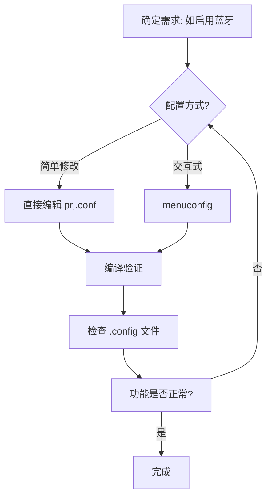

**Kconfig** 用于配置 Zephyr 系统的软件功能（如是否启用蓝牙、设置日志级别、调整内核参数等）。

### **核心文件**
  - `prj.conf`：项目的 **主配置** 文件（覆盖默认配置）。
  - `Kconfig`：定义配置选项的规则文件（位于 Zephyr 模块或应用目录中）。
  - `boards/<板名>.conf`：板级默认配置。

### **配置的层级关系**
```
默认配置 (Zephyr 内建)
↓
板级配置 (boards/<板名>.conf)
↓
项目配置 (prj.conf 或 其他 .conf 文件)
↓
环境变量/命令行覆盖 (临时修改)
```

---

## **快速上手, 修改配置**
### **方法 1：直接编辑 `prj.conf`**
在项目根目录创建或修改 `prj.conf` 文件：
```kconfig
# 启用蓝牙协议栈
CONFIG_BT=y

# 设置日志级别为调试
CONFIG_LOG_LEVEL=4

# 启用串口控制台
CONFIG_UART_CONSOLE=y
```

### **方法 2：交互式菜单 (`menuconfig`)**
```bash
# 进入配置菜单
west build -b <板名> -t menuconfig
```

- **操作指南**：
  - 方向键导航，空格键选中/取消选项。
  - `/` 搜索配置项（如搜索 `CONFIG_BT`）。
  - 保存后生成 `build/zephyr/.config`（覆盖 `prj.conf` 的配置）。

---

## **Kconfig 语法解释**
### **1. 基本语法规则**
- **启用选项**：
  ```kconfig
  CONFIG_FEATURE_NAME=y  # y表示启用
  ```
- **禁用选项**：
  ```kconfig
  # CONFIG_FEATURE_NAME is not set  # 禁用（或直接删除行）
  ```
- **设置取值 (数值/字符串)**：
  ```kconfig
  CONFIG_LOG_LEVEL=3      # 数值
  CONFIG_DEVICE_NAME="nrf5340"  # 字符串
  ```

### **2. 条件配置（依赖关系）**
在 `Kconfig` 文件中定义的选项可以包含依赖：
```kconfig
config BT
    bool "Enable Bluetooth"
    depends on NETWORKING  # 只有NETWORKING启用时才能选BT
    default y if SOC_NRF5340  # 对NRF5340默认启用
```

---

### 配置选项分为两类：  
**1. Zephyr 内置的固定选项**（由 Zephyr 或芯片厂商定义）  
**2. 用户自定义选项**（由开发者在自己的 `Kconfig` 文件中定义）。  

#### **Zephyr 内置的固定选项示例**：
| 选项                     | 作用                           | 定义位置（Zephyr 源码中）          |
|--------------------------|--------------------------------|-----------------------------------|
| `CONFIG_BT`              | 启用蓝牙协议栈                 | `zephyr/subsys/bluetooth/Kconfig` |
| `CONFIG_LOG_LEVEL`       | 设置日志输出级别               | `zephyr/subsys/logging/Kconfig`   |
| `CONFIG_UART_CONSOLE`    | 启用串口控制台                 | `zephyr/drivers/console/Kconfig`  |
| `CONFIG_GPIO`            | 启用 GPIO 驱动                 | `zephyr/drivers/gpio/Kconfig`     |
| `CONFIG_HEAP_MEM_POOL_SIZE` | 设置堆内存大小               | `zephyr/kernel/Kconfig`           |

内置选项可以从 Zephyr 源码中搜索 `config `查找（eg, 查找蓝牙相关选项: `grep -r "config BT" ${ZEPHYR_BASE}`）, 也可以通过`menuconfig`查找.

开发者可以在自己的项目或模块中定义新的 `CONFIG_XXX` 选项，用于控制应用层行为。  比如:

1. **编写自定义选项**（示例）：  
   ```kconfig
   # my_project/Kconfig
   config CUSTOM_DEVICE_NAME
       string "Device name in my project"
       default "MY_DEVICE"
       help
         This sets the name of the device in the application.
   ```

2. **在代码中使用自定义选项**：  
   ```c
   // src/main.c
   #include <zephyr/kernel.h>

   void main(void) {
       printk("Device name: %s\n", CONFIG_CUSTOM_DEVICE_NAME);
   }
   ```

3. **在 `prj.conf` 中覆盖默认值**（可选）：  
   ```kconfig
   # prj.conf
   CONFIG_CUSTOM_DEVICE_NAME="nrf5340_sensor"
   ```

#### **自定义选项的类型**：
| 类型       | 语法示例                     | 用途               |
|------------|-----------------------------|--------------------|
| **bool**   | `config FOO bool "Enable"`  | 开关（y/n）        |
| **int**    | `config VALUE int "Number"` | 整数值             |
| **string** | `config NAME string "Text"` | 字符串             |
| **hex**    | `config ADDR hex "Address"` | 十六进制值         |

---

### **高级技巧**
#### **1 多配置文件**
- **按功能拆分**：
  ```bash
  # prj.conf 中引入其他文件
  source "${ZEPHYR_BASE}/config/bt.conf"
  ```
- **板级覆盖**：
  ```bash
  # boards/nrf5340dk_nrf5340.conf
  CONFIG_BT=y  # 所有使用此板子的项目默认启用蓝牙
  ```

#### **2 调试配置冲突**
- **查看未满足的依赖**：
  ```bash
  west build -t kconfigcheck
  ```
- **手动检查依赖链**：
  ```bash
  # 在 menuconfig 中按 ? 查看选项的依赖
  ```

#### **3 自定义 Kconfig 选项**
在项目的 `Kconfig` 文件中添加：
```kconfig
# 自定义调试模式开关
config MY_DEBUG_MODE
    bool "Enable my debug mode"
    default n
    help
      This enables additional debug logs for my app.
```

在代码中使用：
```c
#if defined(CONFIG_MY_DEBUG_MODE)
    printk("Debug mode enabled!\n");
#endif
```

---

### **实战示例**：定义一个选项控制是否启用低功耗模式。  
1. **定义选项**：  
   ```kconfig
   # my_project/Kconfig
   config ENABLE_LOW_POWER
       bool "Enable low power mode"
       default n
       help
         If enabled, the device will enter sleep mode when idle.
   ```

2. **在代码中使用**：  
   ```c
   #if defined(CONFIG_ENABLE_LOW_POWER)
       enter_sleep_mode();  // 自定义低功耗函数
   #endif
   ```

3. **在 `prj.conf` 中启用**：  
   ```kconfig
   CONFIG_ENABLE_LOW_POWER=y
   ```

---

## **常见问题**
#### **Q1：自定义选项必须大写吗？**  
- 是的，Kconfig 要求选项名全大写（`CONFIG_XXX`），但值字符串可以是任意大小写。

#### **Q2：如何避免与内置选项冲突？**  
- 为自定义选项添加唯一前缀（如 `CONFIG_MYAPP_XXX`）。

#### **Q3：自定义选项能被 `menuconfig` 看到吗？**  
- 可以！运行 `west build -t menuconfig` 后，在 `Application Configuration` 菜单中查找。

### **Q4: 如何知道某个功能对应的 Kconfig 选项？**
- **方法 1**：在 Zephyr 源码中搜索 `config `（如 `grep -r "config BT"`）。
- **方法 2**：在 `menuconfig` 中搜索功能名称。

### **Q5: 配置未生效怎么办？**
- 检查优先级：`prj.conf` > `board.conf` > 默认配置。
- 确保没有拼写错误（Kconfig 选项区分大小写）。

### **Q6: 如何重置为默认配置？**
```bash
rm -rf build  # 删除构建目录重新生成
```

---

## **小结：Kconfig 配置流程图**


