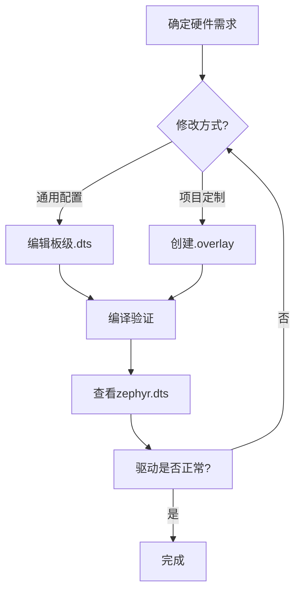

## **设备树（Device Tree）**

通过描述硬件配置（如外设地址、引脚分配、中断号等），实现 **硬件与驱动的解耦**。

- **核心文件**：
  + **`.dts`**：设备树源码（描述硬件）。
  + **`.dtsi`**：设备树包含文件（通用配置，如芯片级定义）。
  + **`.overlay`**：覆盖文件（针对项目的硬件修改）。

- **编译后生成**：
  `zephyr.dts`（最终合并的设备树） → `zephyr.dts.pre.tmp`（预处理后） → `devicetree_generated.h`（供代码使用）。

### **设备树 vs Kconfig**
| **维度**       | **设备树（DTS）**                | **Kconfig**                     |
|----------------|----------------------------------|---------------------------------|
| **职责**       | 描述硬件布局（物理）             | 配置软件功能（逻辑）            |
| **修改方式**   | 编辑 `.dts` 或 `.overlay`        | 编辑 `prj.conf` 或 `menuconfig` |
| **典型内容**   | 外设寄存器地址、引脚映射、时钟   | 启用驱动、日志级别、协议栈      |
| **依赖关系**   | 驱动依赖设备树节点（如 `status = "okay"`） | 驱动依赖 `CONFIG_XXX=y`         |
| **编译生成**   | `devicetree_generated.h`等  | `autoconf.h`等         |

```bash
/build/my-app-template/zephyr/include/generated/zephyr/autoconf.h
```

---

## **快速上手, 修改设备树**
### **方法 1：直接使用板级 DTS**
Zephyr 已为官方开发板（如 `nrf5340dk_nrf5340`）预定义了设备树，路径为：`zephyr/boards/arm/nrf5340dk_nrf5340/nrf5340dk_nrf5340_common.dts` .

### **方法 2：创建 Overlay 文件**
在项目根目录创建 `boards/<board>.overlay` 文件（覆盖默认配置），例如：
```dts
// nrf5340dk_nrf5340_cpuapp.overlay
/ {
    /* 修改或新增节点 */
    &uart0 {
        status = "okay";
        tx-pin = <5>;  // 指定UART0的TX引脚为P0.05
        rx-pin = <6>;  // 指定RX引脚为P0.06
    };

    /* 添加自定义节点 */
    my_sensor: my-sensor {
        compatible = "my-company,sensor";
        int-gpios = <&gpio0 12 GPIO_ACTIVE_HIGH>;
    };
};
```

---

## **设备树语法详解**
### **1. 基本结构**
```dts
/ {                            // 根节点
    node1: node1-label {       // 定义节点（node1-label是标签）
        property1 = <1>;       // 属性（整数）
        property2 = "text";    // 属性（字符串）
        child-node { ... };    // 子节点
    };
};
```

### **2. 常用属性**
| **属性**            | **作用**                          | **示例**                          |
|----------------------|-----------------------------------|-----------------------------------|
| `status`             | 启用/禁用设备                     | `status = "okay";`                |
| `compatible`         | 匹配驱动（需与驱动定义的字符串一致） | `compatible = "nordic,nrf-uarte";` |
| `reg`                | 寄存器地址和大小                  | `reg = <0x40002000 0x1000>;`      |
| `interrupts`         | 中断号                            | `interrupts = <33 1>;`            |
| `pin-control`        | 引脚配置（如GPIO、PWM）           | `psels = <NRF_PSEL(UART_TX, 0, 5)>;` |

### **3. 引用其他节点**
- **通过标签引用**（如 `&uart0`）：
  ```dts
  &uart0 {  // 引用已定义的uart0节点
      status = "okay";
  };
  ```
- **通过路径引用**：
  ```dts
  &{/soc/uart@40002000} { ... };
  ```

---

## **实战：为 nRF5340 配置外设**
### **1. 启用 I2C 接口**
```dts
// nrf5340dk_nrf5340_cpuapp.overlay
&i2c0 {
    status = "okay";
    sda-pin = <26>;  // P0.26
    scl-pin = <27>;  // P0.27

    // 添加I2C设备（如传感器）
    sensor@44 {
        compatible = "ti,hdc1010";
        reg = <0x44>;
    };
};
```

### **2. 配置 PWM 输出**
```dts
&pwm0 {
    status = "okay";
    ch0-pin = <28>;  // P0.28
    ch0-inverted;    // 输出极性反转
};
```

### **3. 自定义 GPIO 按键**
```dts
/ {
    buttons {
        compatible = "gpio-keys";
        button0: button_0 {
            gpios = <&gpio0 11 GPIO_ACTIVE_LOW>; // P0.11
            label = "User Button";
        };
    };
};
```

---

## **在代码中使用设备树**
### **1. 通过 `devicetree.h` 访问节点**
```c
#include <zephyr/devicetree.h>
#include <zephyr/drivers/gpio.h>

#define LED_NODE DT_NODELABEL(led0)  // 引用设备树中的led0节点

void main(void) {
    const struct gpio_dt_spec led = GPIO_DT_SPEC_GET(LED_NODE, gpios);
    gpio_pin_configure_dt(&led, GPIO_OUTPUT_INACTIVE);
}
```

### **2. 检查设备树状态**
```c
if (!device_is_ready(led.port)) {
    printk("LED device not ready\n");
    return;
}
```

---

## **常见问题解答**
### **Q1：如何知道设备树节点的名称（如 `&uart0`）？**
- 查看开发板的 `.dts` 文件（如 `nrf5340dk_nrf5340.dts`），或通过生成的 `zephyr.dts` 搜索。

### **Q2：设备树修改后驱动不工作？**
- 检查 `status = "okay"` 是否设置。
- 确认 `compatible` 属性与驱动匹配（如 `nordic,nrf-uarte`）。
- 验证引脚是否冲突（参考芯片手册）。

### **Q3：如何覆盖默认引脚配置？**
- 在 `overlay` 文件中重新定义 `psels` 或 `pin` 属性：
  ```dts
  &uart0 {
      tx-pin = <5>;
      rx-pin = <6>;
  };
  ```

### **Q4: 调试与验证**
#### **Q4.1 查看最终设备树**
```bash
# 编译后生成的文件
cat build/zephyr/zephyr.dts
```

#### **Q4.2 检查 Overlay 是否生效**
```bash
west build -t menuconfig
# 进入 Hardware Settings → Device Tree Configuration 查看
```

#### **Q4.3 设备树绑定（Bindings）**
- 设备树节点需匹配对应的 `bindings` 文件（YAML格式），定义合法属性和约束。
- 路径：`zephyr/dts/bindings/`，例如 `i2c-device.yaml`。

---

## **总结：设备树配置流程图**


### **关键命令速查**
| **操作**               | **命令**                          |
|------------------------|-----------------------------------|
| 编译并应用Overlay      | `west build -b <板名>`            |
| 查看最终设备树         | `cat build/zephyr/zephyr.dts`     |
| 交互式检查设备树配置   | `west build -t menuconfig`        |
